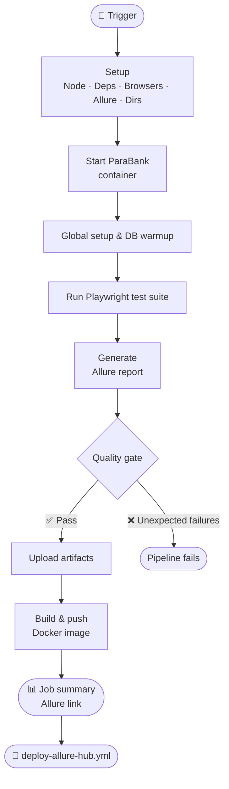
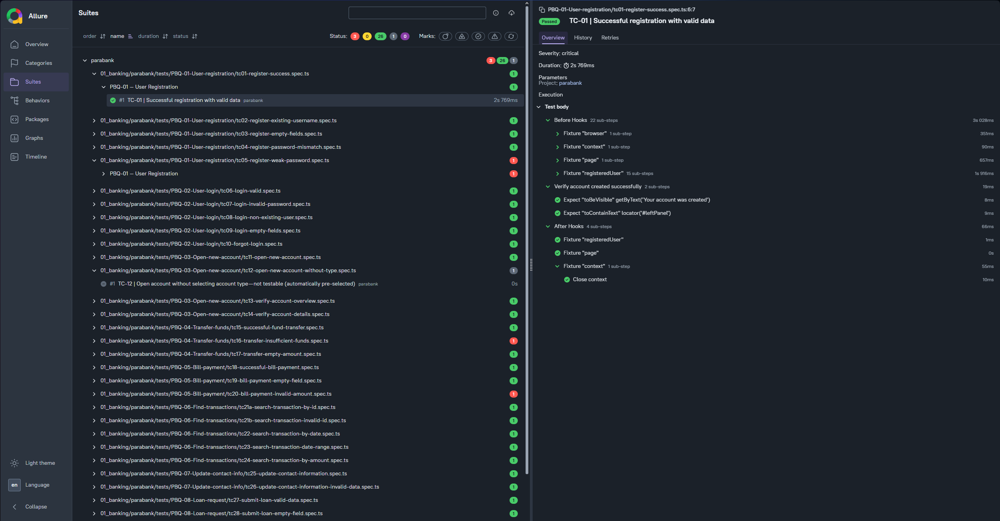

# ParaBank UI


<div align="center">


<br/>


</div>

---

## Overview

This project demonstrates **end-to-end UI automation** for ParaBank, a sample online banking web application.  

</br>

Its goal is to automate common banking scenarios and validate UI functionalities of the application.

👉 ParaBank website : [https://parabank.parasoft.com](https://parabank.parasoft.com/parabank/index.htm)

---

## Project Structure

| Folder | Description |
|------|------|
| [tests](https://github.com/alexB35/qa-automation-portfolio/tree/main/01_banking/parabank/tests) | Playwright test scripts |
| [framework](https://github.com/alexB35/qa-automation-portfolio/tree/main/01_banking/parabank/framework) | Fixtures, helpers, data & page objects |
| [resources](https://github.com/alexB35/qa-automation-portfolio/tree/main/01_banking/parabank/resources) | Config & URLs |
| [docs](https://github.com/alexB35/qa-automation-portfolio/tree/main/01_banking/parabank/docs) | Screenshots of test executions and Allure reports |
| [jira](https://github.com/alexB35/qa-automation-portfolio/tree/main/01_banking/parabank/jira) | Screenshots of Jira boards and cards |

**Jira Board :** [ParaBank - PBQ](https://alexb35.atlassian.net/jira/software/projects/PBQ/boards/1)

---

## Run Tests Locally

Refer to the [root README](../../README.md) for Docker installation.

Then, run in terminal :

```bash
npm install
npx playwright install --with-deps firefox
npx playwright test --project=parabank
```

> Tests can be run at suite, user story, or individual test case level.

---

## CI/CD Pipeline

Tests run automatically on every push to `main` via [parabank-ui.yml](https://github.com/alexB35/qa-automation-portfolio/actions/workflows/parabank-ui.yml).


<div align="center">


</div>

> Playwright is configured to continue on know failure — unexpected failures are caught by the quality gate script.

---

## Allure Reports

Test results are published to GitHub Pages after each CI run via `deploy-allure-hub.yml`.

👉 [Allure Hub](https://alexB35.github.io/qa-automation-portfolio/)
👉 [ParaBank Report](https://alexB35.github.io/qa-automation-portfolio/parabank/)

> Include test steps, logs, and screenshots for failures.



---

> [!IMPORTANT]
> This project targets the local Parabank environment _(localhost:8080)_ rather than the public shared environment. </br> The shared environment is occasionally unstable due to Cloudflare limitations and pentest-related unavailabilities.