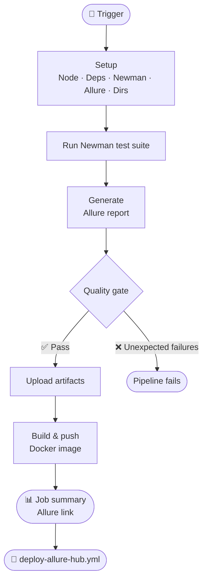

# Restful Booker API


<div align="center">


<br/>


</div>

---

## Overview

This project covers **API automation** for the Restful Booker API.  

It demonstrates CRUD operations via API : create, retrieve, update, and delete bookings. Includes positive and negative scenarios with Newman.

👉 Restful Booker website : [https://restful-booker.herokuapp.com](https://restful-booker.herokuapp.com)

---

## Project Structure

| Folder | Description |
|------|------|
| [postman](https://github.com/alexB35/qa-automation-portfolio/tree/main/02_api/restful_booker/postman) | Collections & environments |
| [docs](https://github.com/alexB35/qa-automation-portfolio/tree/main/02_api/restful_booker/docs) | Screenshots of test executions and Allure reports |
| [jira](https://github.com/alexB35/qa-automation-portfolio/tree/main/02_api/restful_booker/jira) | Screenshots of Jira boards and cards |

**Jira board :** [Restful Booker - RFB](https://alexb35.atlassian.net/jira/software/projects/RFB/boards/2)

---

## Run Tests Locally

Refer to the [root README](../../README.md) for Docker installation.

Then, run in terminal :

```bash
npm install
npm run test:restful-booker
```

> Collections are executed sequentially — prerequisites must run first to generate the auth token.
> Each collection targets a specific CRUD operation.

---

## CI/CD Pipeline

Tests run automatically on every push to `main` via [restful-booker-api.yml](https://github.com/alexB35/qa-automation-portfolio/actions/workflows/restful-booker-api.yml).


<div align="center">


</div>

---

## Allure Reports

Test results are published to GitHub Pages after each CI run via `deploy-allure-hub.yml`.

👉 [Allure Hub](https://alexB35.github.io/qa-automation-portfolio/)
👉 [Restful Booker Report](https://alexb35.github.io/qa-automation-portfolio/restful-booker/)

> Include test steps, logs, and screenshots for failures.

