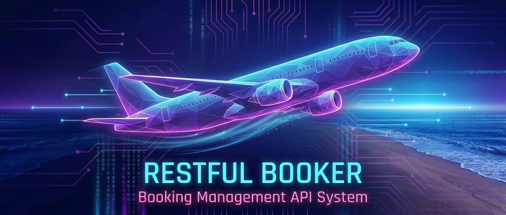
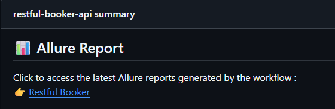
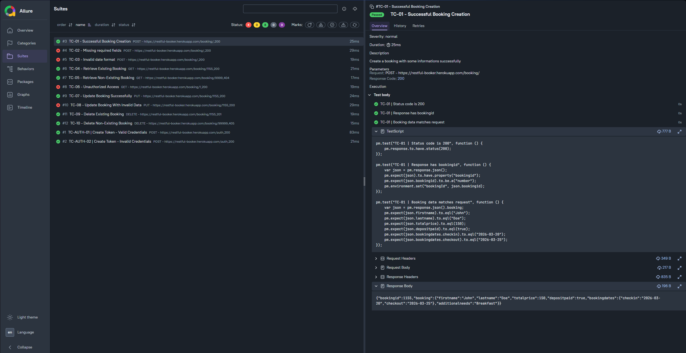

# Restful Booker API




<div align="center">


<br/>


</div>

---

## Overview

This project covers **API automation** for the Restful Booker API.  

It demonstrates CRUD operations via API : create, retrieve, update, and delete bookings. Includes positive and negative scenarios with Newman.

[https://restful-booker.herokuapp.com](https://restful-booker.herokuapp.com)

---

## Tech Stack

- **Postman + Newman** - _API testing_
- **Docker** - _containerized execution_
- **GitHub Actions** - _CI/CD_

---

## Project Structure

| Folder | Description |
|------|------|
| [postman](https://github.com/alexB35/qa-automation-portfolio/tree/main/02_api/restful_booker/postman) | Collections & environments |
| [docs](https://github.com/alexB35/qa-automation-portfolio/tree/main/02_api/restful_booker/docs) | Screenshots of test executions and Allure reports |
| [jira](https://github.com/alexB35/qa-automation-portfolio/tree/main/02_api/restful_booker/jira) | Screenshots of Jira boards and cards |

**Jira board :** [RFB Board](https://alexb35.atlassian.net/jira/software/projects/RFB/boards/2)

---

## How to Run Tests

Refer to the [root README](../../README.md) for Docker and CI instructions.

## Locally 

```bash
newman run 02_api/restful_booker/5_postman/RFB-00_Prerequisites.postman_collection.json \
  -e 02_api/restful_booker/5_postman/environment.json
```

## Using GitHub Actions

Trigger the workflow : [restful-booker-api](https://github.com/alexB35/qa-automation-portfolio/actions/workflows/restful-booker-api.yml)

## Reports

Test execution results are automatically generated after each workflow run using Allure (consultible in GitHub Actions or downloadable artifacts).

Once the _deploy-allure-reports_ is done, you can consult :

**This page :** [Allure-Hub] (https://alexb35.github.io/qa-automation-portfolio/)

or you can consult :

**The report :** [Restful-Booker] (https://alexb35.github.io/qa-automation-portfolio/restful-booker/)



## Allure



---

> [!NOTE]
> Collections are executed sequentially — prerequisites must run first to generate the auth token.
> Each collection targets a specific CRUD operation.