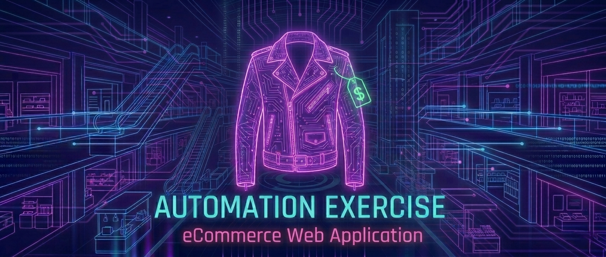
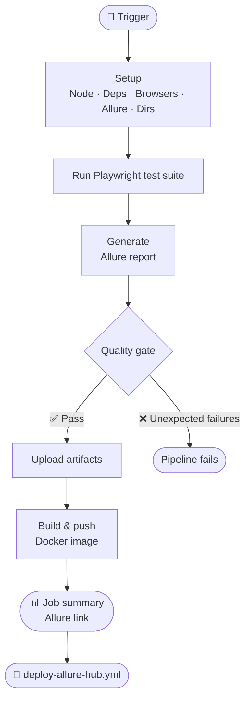

# Automation Exercise UI / API




<div align="center">


<br/>


</div>

---

## Overview

This project demonstrates **UI + API automation** for "Automation Exercise", an e-commerce platform.  

Automates online shopping flows including registration, login, product browsing, checkout and an API scenarios.

👉 Automation Exercise website : [https://automationexercise.com](https://automationexercise.com)

---

## Project Structure

| Folder | Description |
|------|------|
| [tests](https://github.com/alexB35/qa-automation-portfolio/tree/main/03_ecommerce/automation-exercise/tests) | Playwright test scripts |
| [framework](https://github.com/alexB35/qa-automation-portfolio/tree/main/03_ecommerce/automation-exercise/framework) | Fixtures, helpers, page objects & API clients |
| [resources](https://github.com/alexB35/qa-automation-portfolio/tree/main/03_ecommerce/automation-exercise/resources) | Config & test data |
| [docs](https://github.com/alexB35/qa-automation-portfolio/tree/main/03_ecommerce/automation-exercise/docs) | Screenshots of test executions and Allure reports |
| [jira](https://github.com/alexB35/qa-automation-portfolio/tree/main/03_ecommerce/automation-exercise/jira) | Screenshots of Jira boards and cards | 

**Jira board :** [AEX Board](https://alexb35.atlassian.net/jira/software/projects/AEX/boards/3)

---

## Run Tests Locally

Refer to the [root README](../../README.md) for Docker installation.

```bash
npm install
npx playwright install --with-deps firefox
npx playwright test --project=automation-exercise
```

> Tests can be run at suite, user story, or individual test case level.

---

## CI/CD Pipeline

Tests run automatically on every push to `main` via [automation-exercise-ui-api.yml](https://github.com/alexB35/qa-automation-portfolio/actions/workflows/automation-exercise-ui-api.yml).

<div align="center">


</div>

> Playwright is configured to continue on know failure — unexpected failures are caught by the quality gate script.

---

## Allure Reports

Test results are published to GitHub Pages after each CI run via `deploy-allure-hub.yml`.

👉 [Allure Hub](https://alexB35.github.io/qa-automation-portfolio/)
👉 [Automation Exercise Report](https://alexb35.github.io/qa-automation-portfolio/automation-exercise/)

> Include test steps, logs, and screenshots for failures.

