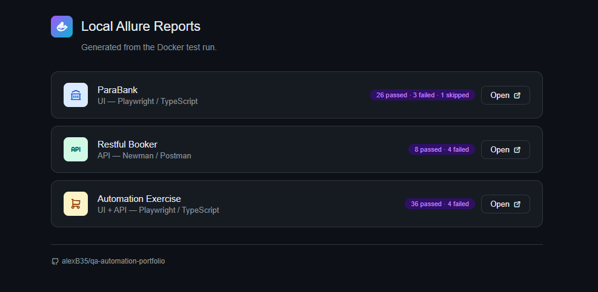

# QA Automation Portfolio


---

<div align="center">


<br/>


</div>

---

## Overview

A QA automation portfolio featuring UI & API testing, CI/CD pipelines via GitHub Actions, Allure reporting on GitHub Pages, and Docker image distribution for containerized local execution.

<details>
<summary>About Docker usage</summary>

</br>

> Tests run directly on GitHub Actions runners in CI. </br> A Docker image is published to Docker Hub to run tests locally — no dependencies required beyond Docker Desktop.

</details>

---

## Framework features

- Reusable fixtures & helpers
- Dynamic test data generation
- API cleanup hooks
- Isolated test execution
- CI-ready architecture

---

## QA workflow

Each application has its own dedicated CI/CD workflow, allowing independent execution and clear reporting.

| Phase | Tool |
|-------|------|
| Test Design | Jira |
| UI Automation | Playwright + TypeScript |
| API Automation | Postman + Newman |
| CI/CD | GitHub Actions |
| Reporting | Allure → GitHub Pages |
| Distribution | Docker Hub |

---

## Test Strategy

This portfolio follows a structured QA approach to ensure high-quality, reliable, and maintainable automated tests across multiple applications.

| Dimension | Details |
|-----------|---------|
| Scope | UI & API automation — independent, reusable tests |
| Approach | Modular, data-driven tests orchestrated via GitHub Actions |
| Test Types | Functional, positive/negative, validation, API contract |
| Reporting | Allure reports on GitHub Pages with failure screenshots, CI artifacts |

> Playwright is configured to run with 2 workers to ensure consistent execution across different hardware configurations.

---

## GitHub Project Structure

| Application | Description |
|------|------|
| [ParaBank](./01_banking/parabank/README.md) | UI automation for banking scenarios |
| [Restful Booker](./02_api/restful_booker/README.md) | API automation for booking management scenarios |
| [Automation Exercise](./03_ecommerce/automation-exercise/README.md) | UI and API automation for e-commerce scenarios |
| [scripts](./scripts) | Shared CI/CD scripts — dirs clean, Newman runner and quality gate |
| [workflows](./.github/workflows) | CI/CD workflows - 3 applications and Allure Hub deploy |

> Known failures are documented in Jira and summarized in [Issues](https://github.com/alexB35/qa-automation-portfolio/issues)

---

## Allure Hub

Tests run on GitHub Actions runners in CI using 2 workers. 

Allure reports for all 3 applications are centralized in the Allure Hub (GitHub Pages), deployed via `deploy-allure-hub.yml` after each CI run.

👉 Open the [Allure Hub](https://alexb35.github.io/qa-automation-portfolio/)


---

## Allure Report Sample


---

## How to Run Tests Locally

_For local execution, a Docker image is available on Docker Hub — no dependencies required beyond Docker Desktop._

**Prerequisites :** 
[Docker Desktop](https://www.docker.com/get-started)

<br/>

**Open Docker and run this command line :**
```bash
git clone https://github.com/alexB35/qa-automation-portfolio.git
cd qa-automation-portfolio
npm run docker:reports
```

> For the ParaBank application, the test suite starts automatically once the container is ready.
> Reports are generated locally in `./reports/`.

## Local Allure Hub

A local Allure Hub will open in your browser on [localhost:9323](http://localhost:9323) at the end of the tests.

<br/>

It works the same way as the Allure Hub of GitHub Pages.



---

> [!NOTE]
> Test data is dynamically generated. </br> Tests are independent and isolated. </br> Allure reports are published to [GitHub Pages](https://alexB35.github.io/qa-automation-portfolio/) after each CI run and remain accessible until the next CI run overwrites them.

> [!WARNING]
> Docker image may includes known dependency vulnerabilities. </br> In a real environment, dependencies would be pinned to secure versions and a minimal base image used.