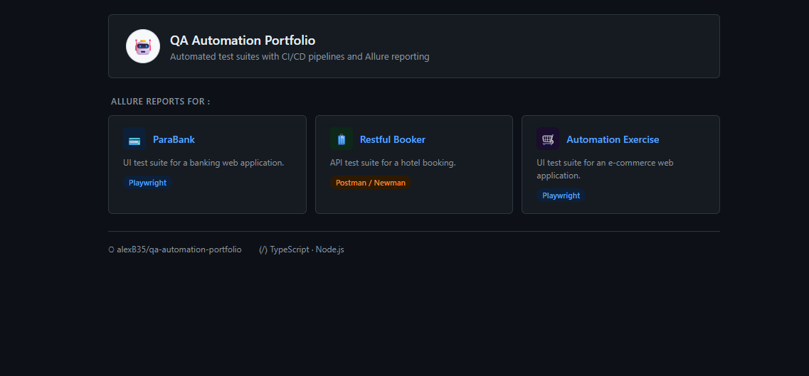

# QA Automation Portfolio


---

<div align="center">


<br/>


</div>

---

## Overview

A QA automation portfolio featuring UI & API testing, CI/CD pipelines via GitHub Actions, Allure reporting on GitHub Pages, and Docker image distribution for local execution.

---

## Framework features

- Reusable fixtures & helpers
- Data-driven testing
- Dynamic test data generation
- API cleanup hooks
- Isolated test execution
- CI-ready architecture


## QA workflow

Each application has its own dedicated CI workflow, allowing independent execution and clear reporting.

| Phase | Tool |
|-------|------|
| Test Design | Jira |
| UI Automation | Playwright + TypeScript |
| API Automation | Postman + Newman |
| CI/CD | GitHub Actions |
| Reporting | Allure → GitHub Pages |
| Distribution | Docker Hub |

---

## Test Strategy

| Dimension | Details |
|-----------|---------|
| Scope | UI & API automation — independent, reusable tests |
| Approach | Modular, data-driven tests in Docker containers, orchestrated via GitHub Actions |
| Test Types | Functional, positive/negative, validation, API contract |
| Reporting | Allure reports on GitHub Pages — failure screenshots — CI artifacts |

This portfolio follows a structured QA approach to ensure high-quality, reliable, and maintainable automated tests across multiple applications.

### 1️⃣ Scope
_UI & API automation, independent and reusable tests._

### 2️⃣ Approach
_Modular, reusable and data-driven tests executed in Docker containers; orchestrated via GitHub Actions._

### 3️⃣ Types of Tests
_Functional, API, positive/negative and validation testing._

### 4️⃣ Reporting & Results
_Playwright & Newman HTML reports; failure screenshots; CI artifacts for traceability._

---

## Project Structure

| Application | Description |
|------|------|
| [ParaBank](./01_banking/parabank/README.md) | UI automation for banking scenarios |
| [Restful Booker](./02_api/restful_booker/README.md) | API testing for booking management scenarios |
| [Automation Exercise](./03_ecommerce/automation-exercise/README.md) | UI and API automation for e-commerce scenarios |

---

## Tech Stack

- **Playwright** - _UI & API automation_
- **Postman + Newman** - _API execution_
- **TypeScript / Node.js**
- **Docker** - _containerized execution_
- **GitHub Actions** - _CI/CD integration_
- **Allure** - _test reporting_
- **Jira** - _test management_

---

## How to Run Tests

_Tests run directly on GitHub Actions runners. A Docker image is built and published to Docker Hub for local execution without local dependencies._

**Prerequisites :** 
[Install Docker Desktop](https://www.docker.com/get-started)

<br/>

**Clone the repository :**
```bash
git clone https://github.com/alexB35/qa-automation-portfolio.git
cd qa-automation-portfolio
```

<br/>

**Run tests with volume mount :** (recommended — reports are accessible locally):
```bash
docker run --rm -v $(pwd)/reports:/app/outputs qa-portfolio
```

<br/>

**Or run without volume mount :**
```bash
docker run --rm qa-portfolio
```

Reports are generated inside each app's `outputs/` folder and accessible at `./reports/` on your machine.

---

## Allure Hub

The reports of the 3 applications are centralized in the Allure Hub after generation of XXXXXXXXXXXXXXXX



[Allure-Hub] (https://alexb35.github.io/qa-automation-portfolio/)

---

## Report sample


---

> [!NOTE]
> Test data is dynamically generated. Tests are independent and isolated.

> [!NOTE]
> Simply run each application workflow in GitHub Actions, and open Allure reports once generated by _deploy-allure-reports-to-pages_


> [!WARNING]
> Docker image includes known npm dependency vulnerabilities. In a real environment, dependencies would be pinned to secure versions and a minimal base image used.