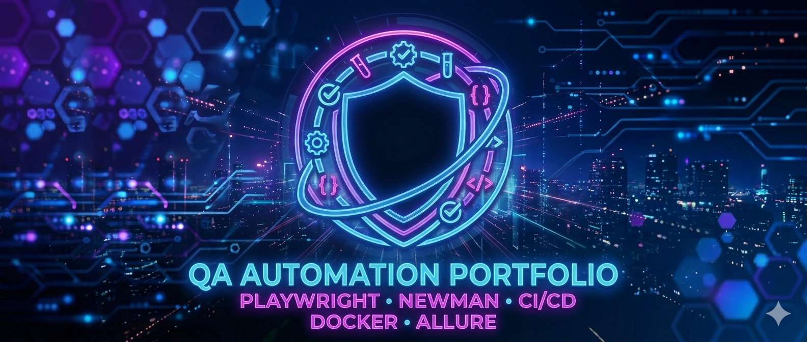

# QA Automation Portfolio



## _A dockerized QA automation framework featuring UI/API testing, CI/CD pipelines and Allure reporting._

> Open to QA Automation opportunities.


---

This portfolio demonstrates **UI & API automation**, **containerized execution**, and **CI/CD workflows**.


## Framework features

- Reusable fixtures & helpers
- Data-driven testing
- Dynamic test data generation
- API cleanup hooks
- Isolated test execution
- CI-ready architecture


## QA workflow

_Jira → Test Design → Automation (Playwright / Postman) → Execution (Docker) → CI/CD (GitHub Actions) → Reporting (Allure)_

Each application has its own dedicated CI workflow, allowing independent execution and clear reporting.

---

## Test Strategy

This portfolio follows a structured QA approach to ensure high-quality, reliable, and maintainable automated tests across multiple applications.

### 1️⃣ Scope
_UI & API automation, independent and reusable tests._

### 2️⃣ Approach
_Modular, reusable and data-driven tests executed in Docker containers; orchestrated via GitHub Actions._

### 3️⃣ Types of Tests
_Functional, API, positive/negative and validation testing._

### 4️⃣ Reporting & Results
_Playwright & Newman HTML reports; failure screenshots; CI artifacts for traceability._

---

## Project Structure

| Application | Scope | README |
|------|------|------|
| ParaBank | UI automation for banking scenarios | [ParaBank](./01_banking/parabank/README.md) |
| Restful Booker | API testing for booking management scenarios | [Restful Booker](./02_api/restful_booker/README.md) |
| Automation Exercise | UI and API automation for e-commerce scenarios | [Automation Exercise](./03_ecommerce/automation-exercise/README.md) |

---

## Tech Stack

- **Playwright** (UI & API automation)
- **Postman + Newman** (API execution)
- **TypeScript / Node.js**
- **Docker** (containerized execution)
- **GitHub Actions** (CI/CD integration)
- **Jira** (test management)

---

## How to Run Tests

All tests are containerized — no local dependencies required beyond Docker.

**Prerequisites:** [Install Docker Desktop](https://www.docker.com/get-started)

**Clone the repository:**
```bash
git clone https://github.com/alexB35/qa-automation-portfolio.git
cd qa-automation-portfolio
```

**Run tests with volume mount** (recommended — reports are accessible locally):
```bash
docker run --rm -v $(pwd)/reports:/app/outputs qa-portfolio
```

**Or run without volume mount:**
```bash
docker run --rm qa-portfolio
```

Reports are generated inside each app's `outputs/` folder and accessible at `./reports/` on your machine.

---

## Reporting

Insert Allure Screenshot

---

> [!NOTE]
> Test data is dynamically generated where possible.
> Tests are independent & reusable.
> CI/CD pipelines generate reports and store artifacts automatically.

> [!WARNING]
> Docker image includes known npm dependency vulnerabilities. In a real environment, dependencies would be pinned to secure versions and a minimal base image used.


